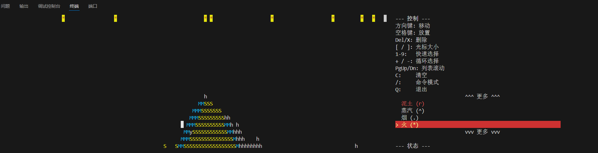
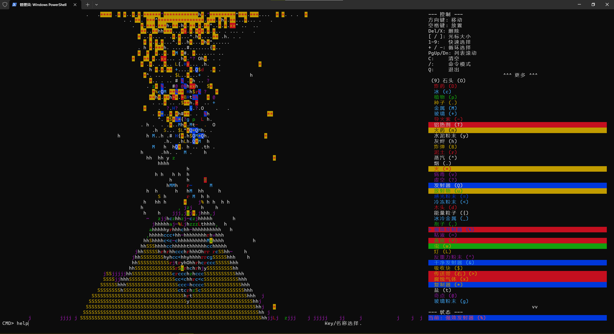
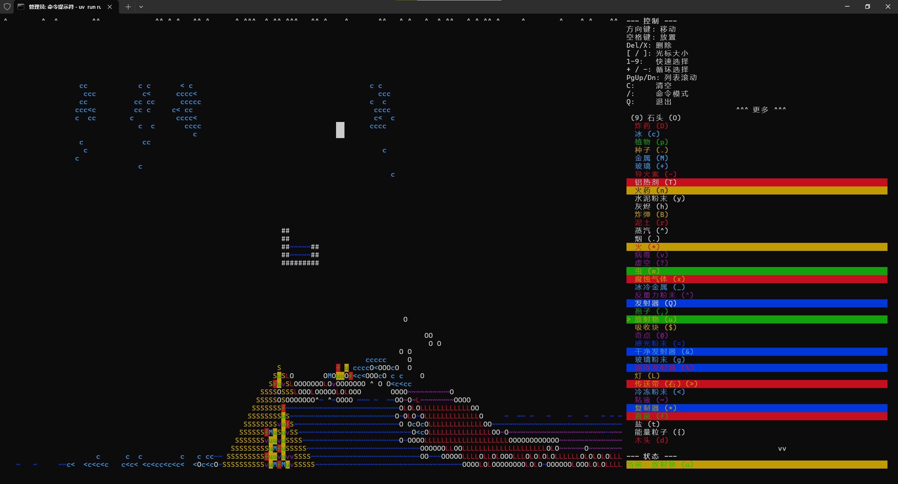

[简体中文](./README_CN.md)

# Falling Sand Game (Terminal Edition)

A simple terminal-based falling sand simulation game built with Python and Curses. Watch various elements interact based on simple rules of gravity, density, heat, and chemical reactions.

## Features

*   Grid-based physics simulation (gravity, flow, gas diffusion).
*   Diverse set of elements with unique properties and interactions (fire, water, acid, growth, etc.).
*   Interactive cursor for placing and deleting elements.
*   Element selection menu.
*   In-game command system for clearing the grid, changing settings, saving/loading, and more.
*   Support for dynamic element loading from modules.

## Screenshot

Running effect in Vscode

Running effect in Powershell

Running effect in CMD

## Requirements

*   Python 3.12 or newer.
*   `curses` library. This is usually included by default on Linux and macOS.
*   `windows-curses` library if you are running on Windows.

## Installation

1.  **Clone the repository:**
    ```bash
    git clone <repository_url> # Replace with the actual repository URL
    cd <repository_name>
    ```
2.  **Install dependencies:**
    Using pip:
    ```bash
    pip install -r requirements.txt # If you have a requirements.txt
    # OR install directly from pyproject.toml (requires pip >= 21.1)
    pip install .
    ```
    Using uv (recommended):
    ```bash
    # Make sure you have uv installed: pip install uv
    uv sync
    ```

    *Note: The `pyproject.toml` specifies `windows-curses` which handles installation on Windows automatically. If you are on Linux/macOS, `pip` or `uv` should skip this dependency.*

## How to Run

Navigate to the root directory of the project (where `run_game.py` and the `falling_sand_game` directory are located) and run:

```bash
python run_game.py
```

The game should launch in your terminal. Ensure your terminal window is large enough to display the grid and the information panel.

## How to Play

The game area is on the left, and an information panel with controls and element selection is on the right. The bottom line is reserved for messages and command input.

*   **Movement:** Use the **Arrow Keys** (Up, Down, Left, Right) or **HJKL** (Vim keys) to move the cursor.
*   **Cursor Size:** Use `[` to decrease the cursor size and `]` to increase it. The cursor determines the area where elements are placed or deleted.
*   **Placing Elements:** Move the cursor to the desired location and press the **Spacebar**. The currently selected element will be placed within the cursor area.
*   **Deleting Elements:** Move the cursor to the desired location and press **Delete** or **X**. This removes elements within the cursor area.
*   **Selecting Elements:**
    *   Use **+** or **=** to cycle forward through the list of available elements.
    *   Use **-** or **_** to cycle backward through the list.
    *   Use **1** through **9** keys to quickly select the element listed with that number in the info panel.
    *   Scroll the element list in the info panel using **Page Up** and **Page Down** keys.
*   **Clearing the Grid:** Press **C** or use the `clear` command.
*   **Command Mode:** Press `/` to enter command mode. Type a command (see below) and press Enter. Pressing `/` again or Enter with an empty command exits command mode.
*   **Quitting:** Press **Q**.

## Commands

Press `/` to enter command mode. The prompt will appear at the bottom of the screen. Type the command and arguments, then press Enter.

*   `help`: Displays a list of available commands.
*   `fill <element_key_or_name>`: Fills a contiguous area starting from the cursor's current position with the specified element. It replaces all connected elements of the *same type* as the element initially under the cursor. You can use the element's key (case-sensitive) or its translated name (case-insensitive).
    *   Example: `/fill W` (Fill with Water) or `/fill 沙子` (Fill with Sand).
*   `clear`: Clears the entire grid, removing all elements. Takes no arguments.
*   `select <element_key_or_name>`: Selects the specified element as the one to be placed by the cursor. You can use the element's key (case-sensitive) or its translated name (case-insensitive). If no argument is given, it shows a list of available elements.
    *   Example: `/select F` (Select Fire) or `/select 泥土` (Select Mud).
*   `size <number>`: Sets the cursor size. Size must be between 1 and the maximum allowed size (currently 10).
    *   Example: `/size 3` (Set cursor size to 3x3).
*   `fps <number>`: Sets the target simulation frames per second. Must be a positive number.
    *   Example: `/fps 60.5`.
*   `speed <multiplier>`: Sets the target FPS based on a multiplier of the default FPS (default is 25). Must be a positive number.
    *   Example: `/speed 2.0` (Set FPS to 50).
*   `tag add|remove|set|clear <tag_name>`: Manages tags applied by the cursor. Tags are applied to new elements placed by the cursor and can sometimes affect appearance (e.g., 'bold', 'flash') or specific element behaviors.
    *   `tag add <tag_name>`: Adds a tag to the current cursor tags.
    *   `tag remove <tag_name>`: Removes a tag from the current cursor tags.
    *   `tag set <tag_name> [...]`: Replaces all current cursor tags with the ones provided.
    *   `tag clear`: Removes all current cursor tags.
    *   Example: `/tag add bold`, `/tag set burning volatile`, `/tag clear`.
*   `save <file_name>`: Saves the current grid state to a JSON file in the current directory. Automatically appends `.json` if no extension is given.
    *   Example: `/save my_world`.
*   `load <file_name>`: Loads a grid state from a JSON file in the current directory. Automatically appends `.json` if no extension is given.
    *   Example: `/load my_world`.
*   `quick_save <number>`: Saves the current state to an in-memory quick save slot (0-9).
    *   Example: `/quick_save 1`.
*   `quick_load <number>`: Loads a state from an in-memory quick save slot (0-9).
    *   Example: `/quick_load 1`.
*   `info`: Displays detailed information about the element currently under the cursor.

You can also type an element's `key` or `name` directly in command mode (without `select`) to select it.

## Element Guide

Elements are listed below by their key, name (translated from the code), character, and a brief description of their behavior. Their interaction logic is primarily defined in their `update` and `run_interactions` methods in the `falling_sand_game/elements/` directory.

| Key | Name (English)    | Char | Type        | Behavior                                                                                                | Properties (Selected)                                     |
|:----|:------------------|:-----|:------------|:--------------------------------------------------------------------------------------------------------|:----------------------------------------------------------|
| `S` | Sand              | `S`  | Powder      | Falls, displaces lighter elements.                                                                      | Dissolvable by Acid (`A`).                                |
| `#` | Wall              | `#`  | StaticSolid | Immovable barrier.                                                                                      | None                                                      |
| `W` | Water             | `~`  | Liquid      | Flows horizontally and downwards, displaces lighter elements. Vaporizes near heat, cools embers/fire.   | Dissolvable by Acid (`A`).                                |
| `L` | Lava              | `L`  | Liquid      | Flows slowly, very hot. Solidifies water/ice into stone, ignites flammable materials.                   | Heat Source, Dissolvable by Acid (`A`).                   |
| `I` | Oil               | `%`  | Liquid      | Flows, lighter than water.                                                                              | Flammable, Dissolvable by Acid (`A`).                     |
| `A` | Acid              | `a`  | Liquid      | Flows, dissolves adjacent dissolvable elements, may self-consume.                                       | Heat Source (minor?), Dissolves.                          |
| `J` | Gasoline          | `j`  | Liquid      | Flows faster than oil, lighter than water.                                                              | Flammable, Dissolvable by Acid (`A`).                     |
| `Z` | Slime             | `z`  | Liquid      | Flows slowly, denser than water/oil.                                                                    | Dissolvable by Acid (`A`).                                |
| `O` | Stone             | `O`  | Solid       | Dense solid, falls if unsupported.                                                                      | Dissolvable by Acid (`A`).                                |
| `D` | Explosive         | `D`  | Solid       | Explodes after a short fuse when heated/lit, creating fire in a radius.                                 | Flammable, Dissolvable by Acid (`A`).                     |
| `C` | Ice               | `c`  | Solid       | Melts into water near heat, cools embers/fire.                                                          | Dissolvable by Acid (`A`), Can be Frozen.                 |
| `P` | Plant             | `p`  | Solid       | Grows upwards into empty space if supported by water or mud below.                                      | Flammable, Dissolvable by Acid (`A`), Can be Grown On.    |
| `E` | Seed              | `.`  | Powder      | Falls. Grows into a plant if on water/mud with empty space above.                                       | Flammable, Dissolvable by Acid (`A`).                     |
| `M` | Metal             | `M`  | StaticSolid | Dense, immovable solid.                                                                                 | Dissolvable by Acid (`A`).                                |
| `X` | Glass             | `+`  | StaticSolid | Dense, immovable solid.                                                                                 | None.                                                     |
| `U` | Fuse              | `-`  | Solid       | Ignites adjacent flammable materials when heated.                                                       | Flammable, Dissolvable by Acid (`A`).                     |
| `T` | Thermite          | `T`  | Powder      | Ignites from strong heat (Fire, Lava, burning Thermite). Burns intensely, turns into Metal.           | Flammable, Dissolvable by Acid (`A`), Heat Source (intense). |
| `N` | Gunpowder         | `n`  | Powder      | Explodes violently into fire when heated/lit.                                                           | Flammable, Dissolvable by Acid (`A`), Explosive.          |
| `Y` | Cement Powder     | `y`  | Powder      | Solidifies into Stone when touching Water. Consumes the water.                                          | Dissolvable by Acid (`A`).                                |
| `H` | Ash               | `h`  | Powder      | Forms Mud when touching Water. Consumes the water.                                                      | Dissolvable by Acid (`A`).                                |
| `b` | Ember             | `b`  | Powder      | Hot, ignites flammable materials. Burns out into Ash or Smoke.                                          | Flammable, Dissolvable by Acid (`A`), Heat Source.        |
| `R` | Mud               | `r`  | Powder      | Behaves like a dense powder. Formed from Ash and Water.                                                 | Dissolvable by Acid (`A`), Can be Grown On.               |
| `G` | Steam             | `^`  | Gas         | Rises, may condense into Water. Can cool embers.                                                        | None.                                                     |
| `K` | Smoke             | `.`  | Gas         | Rises, gradually dissipates.                                                                            | None.                                                     |
| `F` | Fire              | `*`  | Gas         | Rises quickly, spreads, burns flammable materials into Ash, Smoke, or Ember. Burns out into Ash/Smoke. | Flammable, Heat Source.                                   |
| `V` | Virus             | `v`  | Solid       | Spreads horizontally/vertically into adjacent empty cells.                                              | Flammable, Dissolvable by Acid (`A`).                     |
| `?` | Void              | `?`  | StaticSolid | Consumes adjacent non-Wall/non-Void elements.                                                           | None.                                                     |
| `w` | Bug               | `w`  | Movable     | Moves randomly into empty space or displaceable elements. May reproduce near other bugs.                | Flammable, Dissolvable by Acid (`A`).                     |
| `g` | Glass Powder      | `g`  | Powder      | Melts into Glass near heat sources.                                                                     | Dissolvable by Acid (`A`).                                |
| `x` | Corrosive Gas     | `x`  | Gas         | Rises, gradually dissipates. Corrodes (removes) adjacent elements dissolvable by acid.                | Dissolvable by Acid (`A`).                                |
| `_` | Frozen Metal      | `_`  | Solid       | Immovable solid. Slowly melts into Metal.                                                               | None.                                                     |
| `~` | Goo               | `~`  | Liquid      | Flows slowly. Attempts to make adjacent movable elements "stick".                                       | Dissolvable by Acid (`A`).                                |
| `.` | Energy Particle   | `.`  | Movable/Gas | Short-lived particle. Rises/drifts. May trigger effects on adjacent elements (e.g., vaporize water).  | Flammable.                                                |
| `@` | Absorber          | `$`  | StaticSolid | Immovable solid. Absorbs (removes) adjacent movable elements.                                           | None.                                                     |
| `*` | Duplicator        | `*`  | StaticSolid | Immovable solid. Duplicates the element directly above it into adjacent empty cells (down, left, right). | None.                                                     |
| `Q` | Emitter           | `Q`  | Solid       | Immovable solid. Randomly emits a placeable element into an adjacent empty cell.                        | None.                                                     |
| `%` | Powerful Emitter  | `%`  | Solid       | Immovable solid. Randomly emits a placeable element within a radius, replacing content.                 | None.                                                     |
| `&` | Clean Emitter     | `&`  | Solid       | Immovable solid. Randomly emits a placeable element into an adjacent empty cell, excluding the Virus. | None.                                                     |

*(Note: The in-game element selection list order follows the `_ORIGINAL_ORDER` defined in `element_manager.py`, followed by any dynamically loaded elements not in that list.)*

## Saving and Loading

Use the `save <filename>` and `load <filename>` commands to save and load the entire grid state to/from a JSON file. Quick saves (`quick_save <slot>` and `quick_load <slot>`) provide a convenient way to save/load to temporary in-memory slots (0-9) without writing to disk.

The game state is saved as a list of elements with their keys, coordinates, and tags. Note that complex element-specific internal states (like timers, burning status beyond the 'burning' tag) may not be fully preserved unless explicitly added to the serialization/deserialization logic in `command.py`.

## Extending the Game (Modding)

The game is designed to load elements dynamically from the `falling_sand_game/elements/` directory and its subdirectories. To add new elements:

1.  Create a new Python file (e.g., `my_new_element.py`) inside `falling_sand_game/elements/` or a subdirectory (e.g., `falling_sand_game/elements/mod/`).
2.  Define a Python class that inherits from one of the base element types (`Element`, `Movable`, `Powder`, `Liquid`, `Gas`, `Solid`, `StaticSolid`).
3.  Assign a unique `key` (single character), `name` (string), `char` (single character), and `color` (tuple for curses color pair) class attributes.
4.  Implement the `update(self, grid)` and/or `run_interactions(self, grid)` methods to define the element's behavior. Refer to existing elements for examples.
5.  Ensure the element class is importable (e.g., is defined at the top level of its module file).

The game will automatically detect and load your new element when it starts, making it available for selection and placement. If you want your new element to appear in the ordered selection list in the info panel, you need to add its `key` to the `_ORIGINAL_ORDER` list in `falling_sand_game/element_manager.py`.

## Credits

Inspired by various falling sand simulation games.
Developed by Wsdx233 With Google Gemini.


---