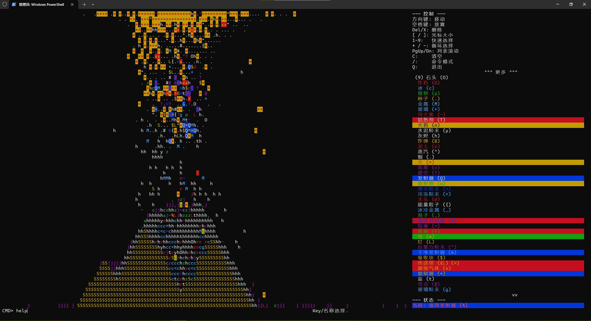
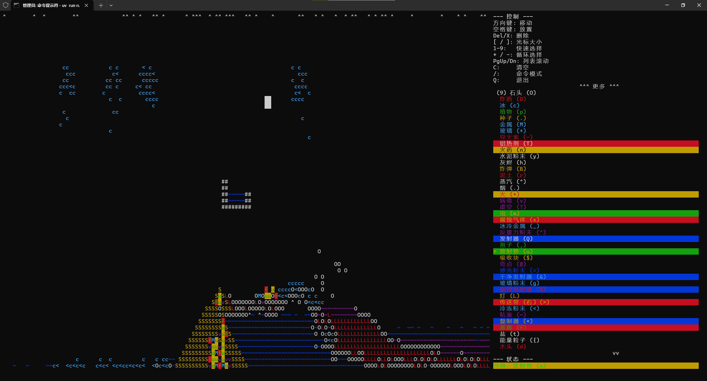

[English](./README.md)
# 落沙游戏（终端）

一个使用 Python 和 Curses 构建的简单美观的可扩展性强的终端落沙模拟游戏。观察各种元素根据简单的重力、密度、热量和化学反应规则进行互动。

## 特点

*   基于网格的物理模拟（重力、流动、气体扩散）。
*   多种具有独特属性和交互的元素（火、水、酸、生长等）。
*   交互式光标，用于放置和删除元素。
*   元素选择菜单。
*   游戏内命令系统，用于清除网格、更改设置、保存/加载等。
*   支持从模块动态加载元素。

## 截图

在Vscode中的运行效果

在Powershell中的运行效果

在CMD中的运行效果


## 推荐要求

*   Python 3.12 或更新版本。
*   `curses` 库。通常在 Linux 和 macOS 上默认包含。
*   如果在 Windows 上运行，需要 `windows-curses` 库。

## 安装

1.  **克隆仓库：**
    ```bash
    git clone <repository_url>
    cd <repository_name>
    ```
2.  **安装依赖项：**
    使用 pip：
    ```bash
    #（需要 pip >= 21.1）
    pip install .
    ```
    使用 uv（推荐）：
    ```bash
    # 确保你已安装 uv：pip install uv
    uv sync
    ```

    *注意：`pyproject.toml` 指定了 `windows-curses`，它会在 Windows 上自动处理安装。如果你在 Linux/macOS 上，`pip` 或 `uv` 会跳过此依赖项。*

## 如何运行

导航到项目根目录（`run_game.py` 和 `falling_sand_game` 目录所在的位置），然后运行：

```bash
python run_game.py
```

游戏应在你的终端中启动。确保你的终端窗口足够大，以便显示网格和信息面板。

## 如何玩

游戏区域在左侧，右侧是包含控件和元素选择的信息面板。最底部一行用于显示消息和输入命令。

*   **移动：** 使用**箭头键**（上、下、左、右）或 **HJKL**（Vim 键）移动光标。
*   **光标大小：** 使用 `[` 减小光标大小，使用 `]` 增大光标大小。光标决定了放置或删除元素的区域。
*   **放置元素：** 将光标移动到所需位置并按下**空格键**。当前选定的元素将放置在光标区域内。
*   **删除元素：** 将光标移动到所需位置并按下 **Delete** 或 **X**。这会移除光标区域内的元素。
*   **选择元素：**
    *   使用 **+** 或 **=** 在可用元素列表中向前循环。
    *   使用 **-** 或 **_** 在列表中向后循环。
    *   使用 **1** 到 **9** 键快速选择信息面板中列出该编号的元素。
    *   使用 **Page Up** 和 **Page Down** 键滚动信息面板中的元素列表。
*   **清除网格：** 按下 **C** 或使用 `clear` 命令。
*   **命令模式：** 按下 `/` 进入命令模式。输入命令（见下文）并按下 Enter。再次按下 `/` 或在空命令下按下 Enter 会退出命令模式。
*   **退出：** 按下 **Q**。

## 命令

按下 `/` 进入命令模式。提示符将出现在屏幕底部。输入命令和参数，然后按下 Enter。

*   `help`: 显示可用命令列表。
*   `fill <element_key_or_name>`: 从光标当前位置开始，使用指定的元素填充连续区域。它会替换光标下最初元素的*相同类型*的所有连接元素。你可以使用元素的 key（区分大小写）或其翻译名称（不区分大小写）。
    *   示例：`/fill W`（用 水 填充）或 `/fill 沙子`（用 沙子 填充）。
*   `clear`: 清除整个网格，移除所有元素。不带参数。
*   `select <element_key_or_name>`: 将指定的元素选为光标要放置的元素。你可以使用元素的 key（区分大小写）或其翻译名称（不区分大小写）。如果不提供参数，则显示可用元素列表。
    *   示例：`/select F`（选择 火）或 `/select 泥土`（选择 泥土）。
*   `size <number>`: 设置光标大小。大小必须在 1 和允许的最大大小之间（目前为 10）。
    *   示例：`/size 3`（将光标大小设置为 3x3）。
*   `fps <number>`: 设置目标模拟帧率。必须是正数。
    *   示例：`/fps 60.5`。
*   `speed <multiplier>`: 根据默认 FPS（默认为 25）的乘数设置目标 FPS。必须是正数。
    *   示例：`/speed 2.0`（将 FPS 设置为 50）。
*   `tag add|remove|set|clear <tag_name>`: 管理光标应用的标签。标签应用于光标放置的新元素，有时会影响外观（例如，'bold'，'flash'）或特定的元素行为。
    *   `tag add <tag_name>`: 将标签添加到当前光标标签中。
    *   `tag remove <tag_name>`: 从当前光标标签中移除标签。
    *   `tag set <tag_name> [...]`: 用提供的标签替换所有当前光标标签。
    *   `tag clear`: 移除所有当前光标标签。
    *   示例：`/tag add bold`，`/tag set burning volatile`，`/tag clear`。
*   `save <file_name>`: 将当前网格状态保存到当前目录中的 JSON 文件。如果未提供扩展名，则自动添加 `.json`。
    *   示例：`/save my_world`。
*   `load <file_name>`: 从当前目录中的 JSON 文件加载网格状态。如果未提供扩展名，则自动添加 `.json`。
    *   示例：`/load my_world`。
*   `quick_save <number>`: 将当前状态保存到内存中的快速保存槽（0-9）。
    *   示例：`/quick_save 1`。
*   `quick_load <number>`: 从内存中的快速保存槽（0-9）加载状态。
    *   示例：`/quick_load 1`。
*   `info`: 显示光标下当前元素的详细信息。

你也可以直接在命令模式中输入元素的 `key` 或 `name`（不带 `select`）来选择它。

## 元素指南

下方列出了元素的 key、名称（从代码翻译而来）、字符以及对其行为的简要描述。它们的交互逻辑主要定义在 `falling_sand_game/elements/` 目录中的 `update` 和 `run_interactions` 方法中。

| Key | 名称 (中文) | Char | 类型       | 行为                                                                                              | 属性 (部分)                                             |
|:----|:------------|:-----|:-----------|:--------------------------------------------------------------------------------------------------|:--------------------------------------------------------|
| `S` | 沙子        | `S`  | 粉末       | 下落，取代更轻的元素。                                                                            | 可被 酸 (`A`) 溶解。                                    |
| `#` | 墙          | `#`  | 静态固体   | 不可移动的屏障。                                                                                  | 无                                                      |
| `W` | 水          | `~`  | 液体       | 水平向下流动，取代更轻的元素。靠近热源会汽化，冷却余烬/火。                                       | 可被 酸 (`A`) 溶解。                                    |
| `L` | 岩浆        | `L`  | 液体       | 缓慢流动，非常热。将水/冰固化为石头，点燃易燃物质。                                               | 热源，可被 酸 (`A`) 溶解。                              |
| `I` | 油          | `%`  | 液体       | 流动，比水轻。                                                                                    | 易燃，可被 酸 (`A`) 溶解。                              |
| `A` | 酸          | `a`  | 液体       | 流动，溶解相邻可溶解的元素，可能会自我消耗。                                                      | 热源（轻微？），溶解。                                  |
| `J` | 汽油        | `j`  | 液体       | 流动比油快，比水轻。                                                                              | 易燃，可被 酸 (`A`) 溶解。                              |
| `Z` | 史莱姆      | `z`  | 液体       | 缓慢流动，密度比水/油大。                                                                         | 可被 酸 (`A`) 溶解。                                    |
| `O` | 石头        | `O`  | 固体       | 致密固体，如果无支撑则下落。                                                                      | 可被 酸 (`A`) 溶解。                                    |
| `D` | 炸药        | `D`  | 固体       | 加热/点燃后短暂延迟后爆炸，在半径范围内产生火焰。                                                 | 易燃，可被 酸 (`A`) 溶解。                              |
| `C` | 冰          | `c`  | 固体       | 靠近热源融化成水，冷却余烬/火。                                                                   | 可被 酸 (`A`) 溶解，可被冷冻。                          |
| `P` | 植物        | `p`  | 固体       | 如果下方有水或泥土支撑，则向上生长到空隙中。                                                      | 易燃，可被 酸 (`A`) 溶解，可被在其上生长。              |
| `E` | 种子        | `.`  | 粉末       | 下落。如果在水/泥土上且上方有空隙，则长成植物。                                                   | 易燃，可被 酸 (`A`) 溶解。                              |
| `M` | 金属        | `M`  | 静态固体   | 致密，不可移动的固体。                                                                            | 可被 酸 (`A`) 溶解。                                    |
| `X` | 玻璃        | `+`  | 静态固体   | 致密，不可移动的固体。                                                                            | 无。                                                    |
| `U` | 引线        | `-`  | 固体       | 加热时点燃相邻的易燃物质。                                                                        | 易燃，可被 酸 (`A`) 溶解。                              |
| `T` | 铝热剂      | `T`  | 粉末       | 被强热（火、岩浆、燃烧的铝热剂）点燃。剧烈燃烧，变成金属。                                        | 易燃，可被 酸 (`A`) 溶解，热源（强烈）。                |
| `N` | 火药        | `n`  | 粉末       | 加热/点燃时剧烈爆炸成火焰。                                                                       | 易燃，可被 酸 (`A`) 溶解，爆炸性。                      |
| `h` | 灰烬        | `h`  | 粉末       | 接触水时形成泥土。消耗水。                                                                        | 可被 酸 (`A`) 溶解。                                    |
| `b` | 余烬        | `b`  | 粉末       | 热，点燃易燃物质。燃尽成灰烬或烟。                                                                | 易燃，可被 酸 (`A`) 溶解，热源。                        |
| `R` | 泥土        | `r`  | 粉末       | 行为像致密粉末。由灰烬和水形成。                                                                  | 可被 酸 (`A`) 溶解，可被在其上生长。                  |
| `G` | 蒸汽        | `^`  | 气体       | 上升，可能凝结成水。可以冷却余烬。                                                                | 无。                                                    |
| `K` | 烟          | `.`  | 气体       | 上升，逐渐消散。                                                                                  | 无。                                                    |
| `F` | 火          | `*`  | 气体       | 快速上升，扩散，将易燃物质燃烧成灰烬、烟或余烬。燃尽成灰烬/烟。                                     | 易燃，热源。                                              |
| `V` | 病毒        | `v`  | 固体       | 水平/垂直传播到相邻的空单元格。                                                                   | 易燃，可被 酸 (`A`) 溶解。                              |
| `?` | 虚空        | `?`  | 静态固体   | 消耗相邻的非墙/非虚空元素。                                                                       | 无。                                                    |
| `w` | 虫子        | `w`  | 可移动     | 随机移动到空隙或可被取代的元素中。可能在其他虫子附近繁殖。                                        | 易燃，可被 酸 (`A`) 溶解。                              |
| `g` | 玻璃粉      | `g`  | 粉末       | 靠近热源融化成玻璃。                                                                              | 可被 酸 (`A`) 溶解。                                    |
| `x` | 腐蚀性气体  | `x`  | 气体       | 上升，逐渐消散。腐蚀（移除）相邻可被酸溶解的元素。                                                | 可被 酸 (`A`) 溶解。                                    |
| `_` | 冷冻金属    | `_`  | 固体       | 不可移动的固体。缓慢融化成金属。                                                                  | 无。                                                    |
| `~` | 粘液        | `~`  | 液体       | 缓慢流动。试图让相邻的可移动元素“粘住”。                                                          | 可被 酸 (`A`) 溶解。                                    |
| `.` | 能量粒子    | `.`  | 可移动/气体 | 短暂存在的粒子。上升/漂移。可能触发对相邻元素的影响（例如，使水汽化）。                           | 易燃。                                                    |
| `@` | 吸收器      | `$`  | 静态固体   | 不可移动的固体。吸收（移除）相邻的可移动元素。                                                    | 无。                                                    |
| `*` | 复制器      | `*`  | 静态固体   | 不可移动的固体。将正上方元素复制到相邻的空单元格中（下、左、右）。                                | 无。                                                    |
| `Q` | 发射器      | `Q`  | 固体       | 不可移动的固体。随机向相邻的空单元格发射一个可放置的元素。                                        | 无。                                                    |
| `%` | 强力发射器  | `%`  | 固体       | 不可移动的固体。在半径范围内随机发射一个可放置的元素，替换内容。                                    | 无。                                                    |
| `&` | 清洁发射器  | `&`  | 固体       | 不可移动的固体。随机向相邻的空单元格发射一个可放置的元素，不包括病毒。                            | 无。                                                    |

*（注意：游戏内的元素选择列表顺序遵循 `falling_sand_game/element_manager.py` 中定义的 `_ORIGINAL_ORDER`，然后是未在该列表中的任何动态加载的元素。）*

## 保存和加载

使用 `save <filename>` 和 `load <filename>` 命令将整个网格状态保存到/加载自 JSON 文件。快速保存（`quick_save <slot>` 和 `quick_load <slot>`）提供了一种便捷的方式，无需写入磁盘即可保存/加载到内存中的临时槽（0-9）。

游戏状态以元素列表的形式保存，包括它们的 key、坐标和标签。请注意，复杂的元素特定内部状态（例如，计时器、燃烧状态超出“burning”标签）可能不会完全保留，除非明确添加到 `command.py` 中的序列化/反序列化逻辑中。

## 扩展游戏 (Modding)

游戏被设计为从 `falling_sand_game/elements/` 目录及其子目录中动态加载元素。要添加新元素：

1.  在 `falling_sand_game/elements/` 或子目录（例如，`falling_sand_game/elements/mod/`）中创建一个新的 Python 文件（例如，`my_new_element.py`）。
2.  定义一个继承自基本元素类型 (`Element`, `Movable`, `Powder`, `Liquid`, `Gas`, `Solid`, `StaticSolid`) 之一的 Python 类。
3.  分配一个唯一的 `key`（单字符）、`name`（字符串）、`char`（单字符）和 `color`（curses 颜色对的元组）类属性。
4.  实现 `update(self, grid)` 和/或 `run_interactions(self, grid)` 方法来定义元素的行为。参考现有元素以获取示例。
5.  确保元素类可导入（例如，在其模块文件的顶层定义）。

游戏启动时将自动检测并加载你的新元素，使其可供选择和放置。如果你希望新元素出现在信息面板中的有序选择列表中，你需要将其 `key` 添加到 `falling_sand_game/element_manager.py` 中的 `_ORIGINAL_ORDER` 列表中。

## 致谢

灵感来自各种落沙模拟游戏。
由 Wsdx233 与 Google Gemini 开发。

---